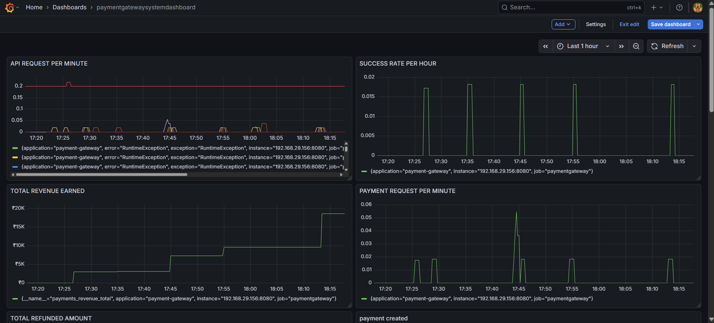
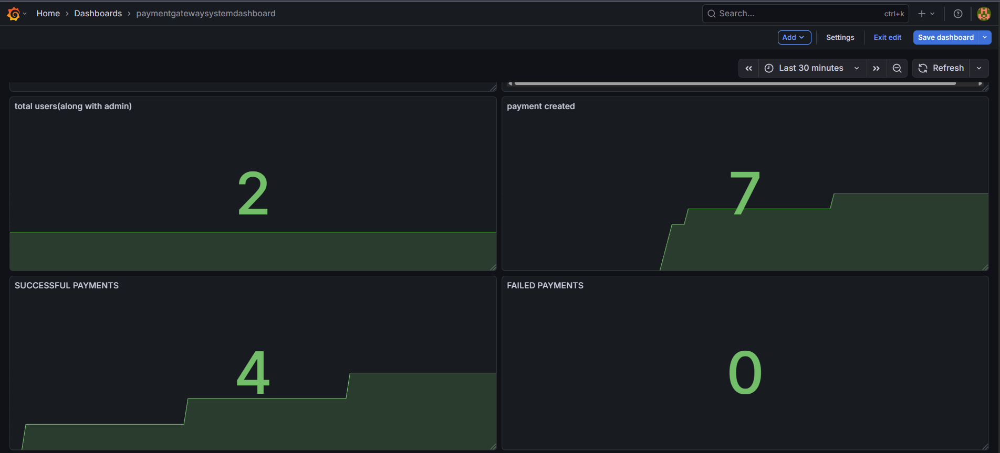
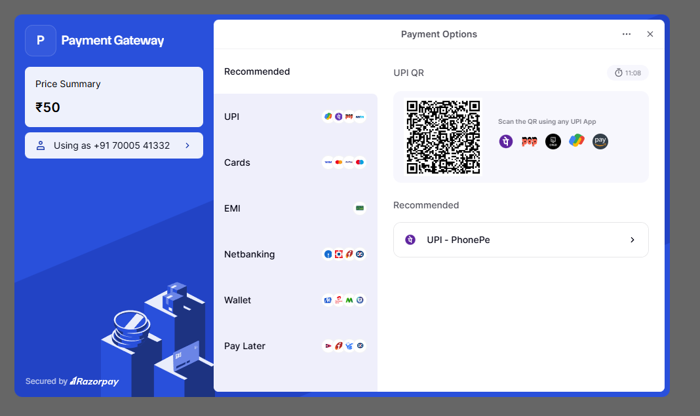
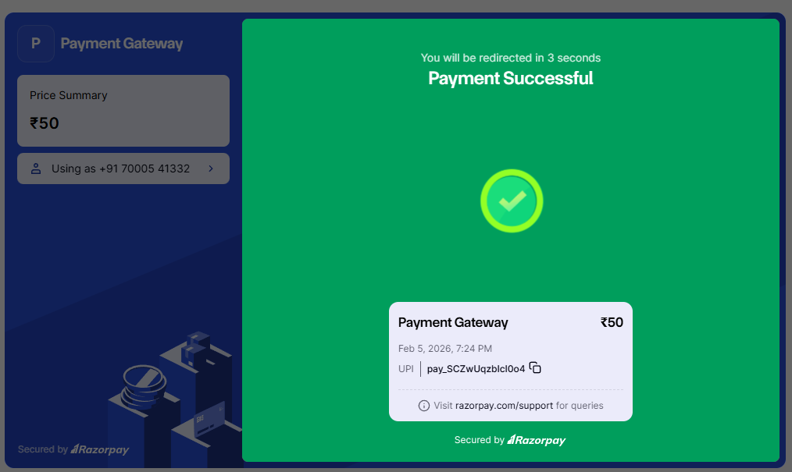
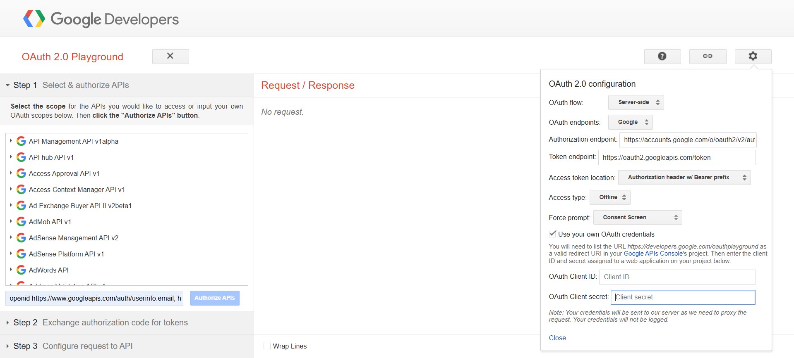

Here is your **FINAL README.md (copy-paste ready)** with screenshots paths already added correctly (since README is outside `paymentgateway` folder).

---

# 💳 Secure Payment Gateway – Spring Boot + Razorpay


---

# 📌 Project Overview

**Secure Payment Gateway** is a production-style backend payment system built using **Spring Boot + Razorpay** that simulates how real fintech/payment gateway systems work.

This project demonstrates **real-world payment architecture + observability**.

It includes:

* Razorpay payment lifecycle
* Idempotent payments using Redis
* Payment state machine
* Webhook verification
* Refund workflow with admin approval
* Email notifications
* Monitoring using Prometheus + Grafana

---

# ✨ Features

## 💰 Razorpay Payment Integration

* Secure Razorpay order creation
* Webhook based payment capture
* Production-style payment lifecycle

---

## 🔁 Idempotent Payments (Redis)

Prevents duplicate payments when users retry requests.

* Redis stores idempotency keys
* Duplicate requests return cached response
* Prevents double charging 💯

---

## 🔐 Payment State Machine

```
CREATED → CAPTURED → SUCCESS → REFUND_REQUESTED → REFUNDED / REJECTED
```

Ensures valid state transitions and data integrity.

---

## 🌐 Razorpay Webhook Integration

* Secure signature verification
* Automatic DB update on payment success
* Event-driven architecture

---

## 🔄 Refund Workflow (Admin Approval)

Real fintech-style refund system:

1. User requests refund
2. Admin receives email
3. Admin approves/rejects refund
4. Razorpay refund triggered
5. User notified via email

---

## 📧 Email Notifications

Automated emails for:

* Refund requested → Admin
* Refund approved → User
* Refund rejected → User
* Invoice PDF emails

---

# 📊 Observability & Monitoring

Full **production monitoring stack** implemented.

### Stack Used

* Spring Boot Actuator
* Micrometer Metrics
* Prometheus
* Grafana

---

## 📈 Custom Business Metrics

| Metric                         | Description            |
| ------------------------------ | ---------------------- |
| payments_total                 | Total payments created |
| payments_success_total         | Successful payments    |
| payments_failure_total         | Failed payments        |
| payments_refunded_total        | Refund count           |
| payments_revenue_total         | Revenue generated      |
| payments_refunded_amount_total | Total refunded money   |
| total_users                    | Total registered users |

These simulate **real fintech KPIs**.

---

## 📊 Grafana Dashboards

### Business Metrics Dashboard

* Payments per minute/hour
* Revenue growth
* Refund trends
* Success vs failure rate
* Total users growth

### System Metrics Dashboard

* JVM memory & CPU
* DB connection pool
* HTTP request metrics
* Thread usage

---

# 🛠 Tech Stack

## Backend

* Java 17
* Spring Boot
* Spring Security + JWT
* Spring Data JPA

## Payment Gateway

* Razorpay Orders API
* Razorpay Webhooks
* Razorpay Refund API

## Database

* MySQL / PostgreSQL

## Caching

* Redis

## Monitoring

* Spring Boot Actuator
* Micrometer
* Prometheus
* Grafana

---

# ⚙️ How It Works

## Create Payment

```
POST /api/payment/create
```

Creates Razorpay order and stores payment.

## Payment Success Webhook

Razorpay triggers → DB updated → metrics updated.

## Refund Flow

User → Request refund → Admin → Approve/Reject → Email notifications.

## Monitoring Pipeline

```
Spring Boot → Micrometer → Prometheus → Grafana
```

Prometheus scrapes:

```
/actuator/prometheus
```

---

# 🚀 How to Run

## Clone Repo

```bash
git clone https://github.com/YOUR_USERNAME/payment-gateway.git
cd payment-gateway
```

## Configure application.properties

```properties
razorpay.key.id=YOUR_KEY
razorpay.key.secret=YOUR_SECRET
razorpay.webhook.secret=YOUR_SECRET
```

Database:

```properties
spring.datasource.url=jdbc:mysql://localhost:3306/paymentdb
spring.datasource.username=root
spring.datasource.password=yourpassword
spring.jpa.hibernate.ddl-auto=update
```

Redis:

```properties
spring.data.redis.host=localhost
spring.data.redis.port=6379
```

---

## Run Backend

```bash
mvn spring-boot:run
```

---

## Run Prometheus

```bash
prometheus.exe --config.file=prometheus.yml
```

Open → [http://localhost:9090](http://localhost:9090)

---

## Run Grafana

Open → [http://localhost:3000](http://localhost:3000)
Login → **admin / admin**

---

# 📸 Screenshots

## 📊 Grafana Dashboard




---

## 💳 Razorpay Checkout



---

## ✅ Payment Success



---

## 🔐 OAuth Playground (Webhook Testing)



---

## 🌐 Webhook via Ngrok


---

## 🚀 Webhook Working


---

# 👨‍💻 Author

**Nihal Singh**

---

# 📄 License

This project is licensed under the **MIT License**.

---

## Third-Party Licenses

This project uses the following open-source software:

### Prometheus

Licensed under the **Apache License 2.0**
[https://github.com/prometheus/prometheus](https://github.com/prometheus/prometheus)

### Grafana

Licensed under the **Apache License 2.0**
[https://github.com/grafana/grafana](https://github.com/grafana/grafana)


